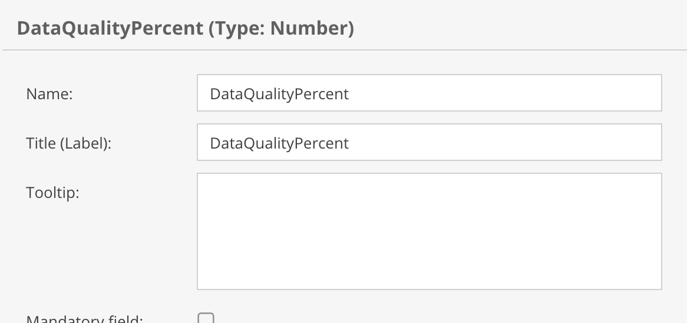
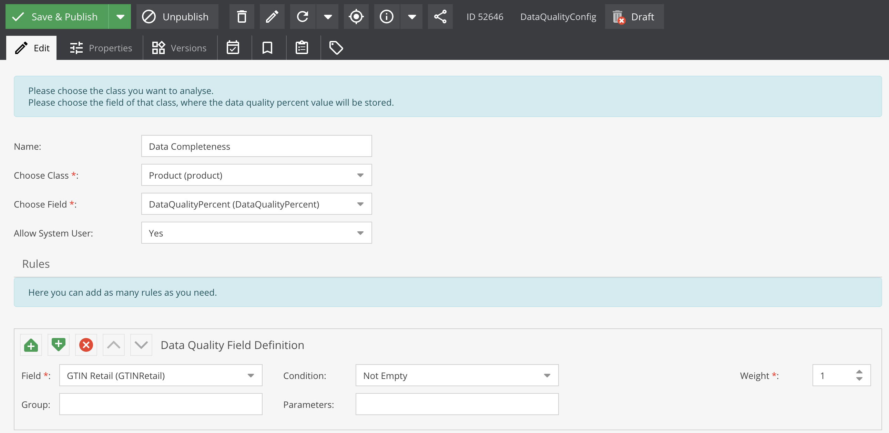
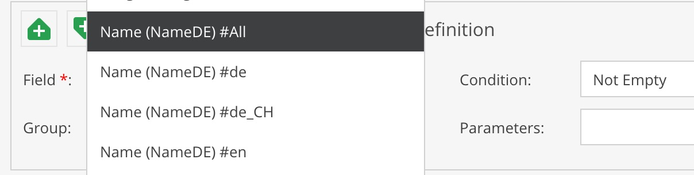
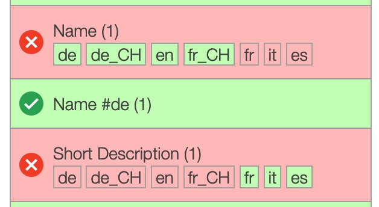
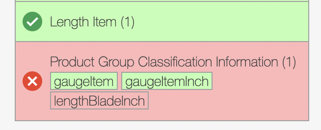
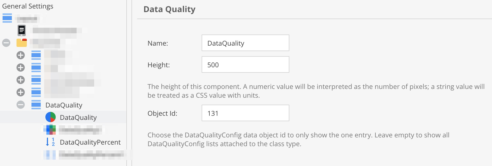
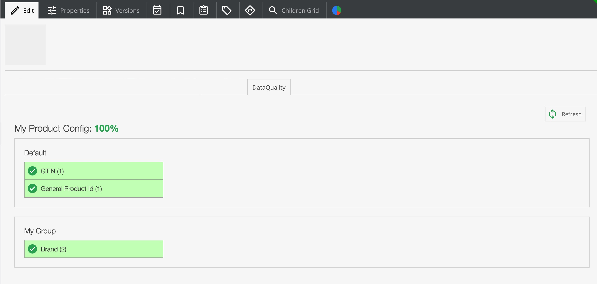
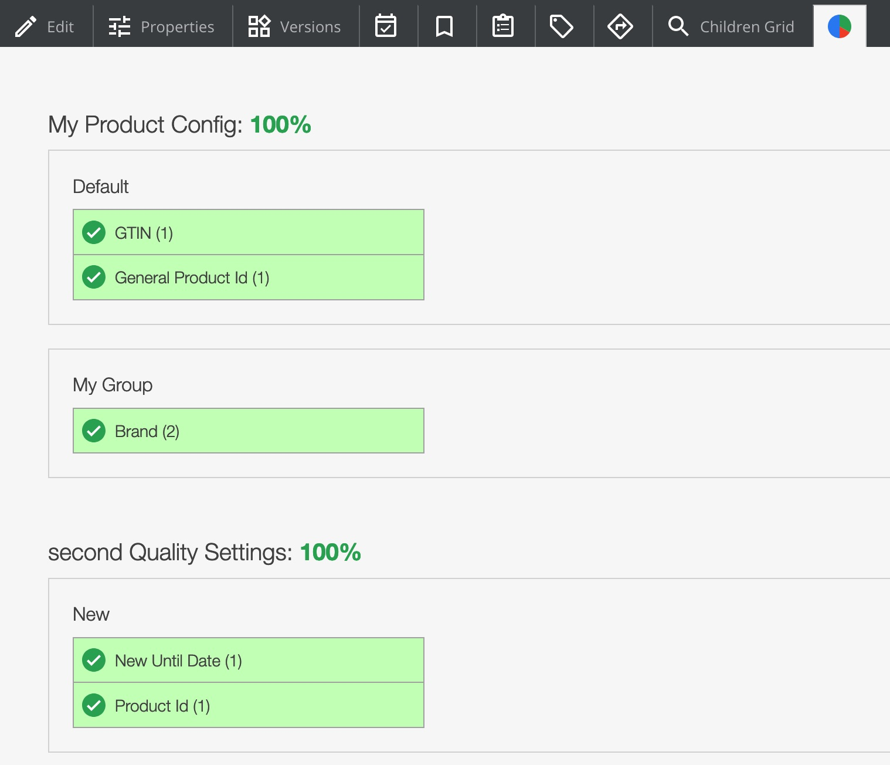
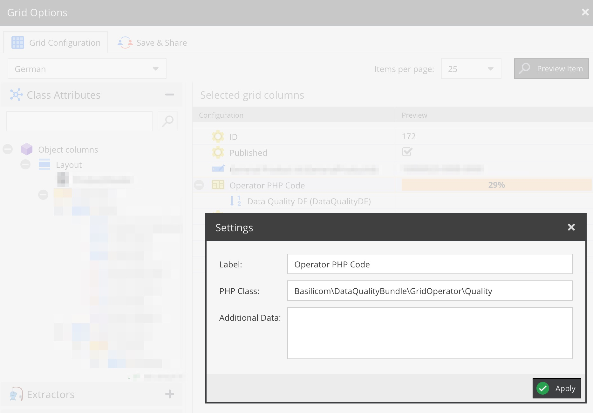
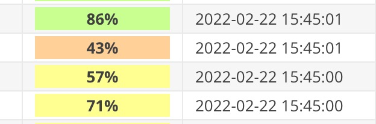

# Data Quality Bundle for Pimcore

Depending on user-configurable weighted rules (data quality configuration objects)
one- or multiple quality values are computed and stored in data objects.

-------

## Version

| Bundle Version | PHP | Pimcore |
|----------------| -----------|---------|
| &lt; 2.0       | ^7.3 | ^6.0    |
| &gt;= 2.0      | ^8.0 | ^10.0   |
| &gt;= 3.0      | ^8.0 | ^11.0   |

## Installation
1. Require the bundle using ``composer require basilicom/pimcore-data-quality-bundle``
3. Enable the bundle ``bin/console pimcore:bundle:enable DataQualityBundle``
3. Install the bundle ``bin/console pimcore:bundle:install DataQualityBundle``

## Configuration

### Add field to object class
* Add a field of type ``number`` to the object class that you want to analyze.



### Add new DataQualityConfig
* Add a new data object of type ``DataQualityConfig`` in your object tree
   * Give it a name
   * Choose a class from the select box and hit ``Save & Publish`` and reload
   * Choose the field you created in step 1 for the data quality percentage
   * Set "Allow System User" to "Yes" if you want to allow system users to trigger an update
   
   

### Rules
* Set Rules
   * Choose the field you want to check
   * Choose the condition you want to check for
      * Some conditions need extra parameters. parameters are ; separated values.
   * Set a weight or use 1 for default weight
      * if you want one field to be double the weight, set to 2
      * set a Group name if you want, or it will be just one group
      
   * Localized fields: The condition current applies to ALL configured
     Pimcore system languages (the condition for a field is only valid, if
     it is valid in all languages) - this should be made configurable via
     configuration parameters in the future.
      
#### Multilanguage Fields
* you can setup multilanguage fields for all languages
  * see example with ``Name (NameDE) #All`` _(NameDE is just the complete fieldname)_
* you can also setup a test for just one language
  * see example with ``Name (NameDE) #de`` _(NameDE is just the complete fieldname)_

* they will be presented differently in the view


#### Object Bricks
* you can see in the view which fields of the object brick are valid (similar to the languages)


### Layout Component ``Data Quality`` (Optional)
* Add the new field type ``Data Quality`` from the Layout Components to the chosen object class
   * it works like a panel so use it where ever you like
   * you can configure on DataQualityConfig object id to show only the one or leave it empty to show all configs
   
   * this is the layout inside of the DataQuality Tab
   
   * or just use the Tab that is added by the bundle that shows all configs
   
   

### Data Quality calculation is updated
* The data quality value field is updated whenever 
   * an object is saved by a normal user (non-system user), or
   * the data quality tab or iframe is displayed, or
   * a full update (re-calculation) of all data quality values was performed via the console command:
```
bin/console dataquality:update <quality-config-id> <batch-size>
```
  

### Grid View
* You can use the "Operator PHP Code" 
   * ``Basilicom\DataQualityBundle\GridOperator\Quality`` on a Data Quality (number) field 
   
   * to get color-coded (red to green) percentages
   


-------

**Authors:** 

* Conrad Guelzow (Basilicom GmbH)
* Kerstin Gerull (Basilicom GmbH)
* Christoph Luehr (Basilicom GmbH)

**License:** GPL v3, see LICENSE
