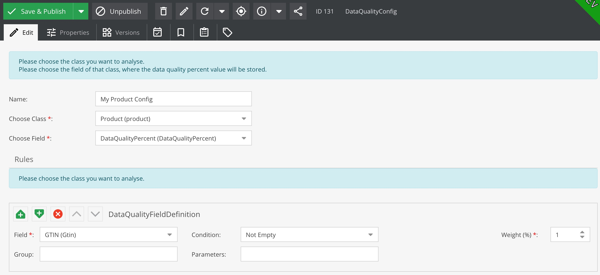

# Data Quality Bundle for Pimcore

With this bundle the data quality of objects can be analysed and displayed.

-------

## Version

| Bundle Version | PHP | Pimcore |
| ----------- | -----------| ----------- |
| &lt; 2.0 | ^7.3 | ^6.0 |
| &gt;= 2.0 | ^8.0 | ^10.0 |

## Installation
1. Install the bundle using ``composer require basilicom/pimcore-data-quality-bundle``
2. Execute ``bin/console pimcore:bundle:install DataQualityBundle``

## Configuration
1. Add a field of type ``number`` to the object class that you want to analyse.

2. Add a new data object of type ``DataQualityConfig`` in your object tree
   * Give it a name
   * Choose a class from the select box and hit ``Save & Publish`` and reload
   * Choose the field you created in step 1 for the data quality percentage
   

3. Rules
   * Choose the field you want to check
   * Choose the condition you want to check for
      * Some conditions need extra parameters. parameters are ; separated values.
   * Set a weight or use 1 for default weight
      * if you want one field to be double the weight, set to 2
      * set a Group name if you want, or it will be just one group
      

4. Add the new field type ``Data Quality`` from the Layout Components to the chosen object class
   * it works like a panel so use it where ever you like
   * you can configure on DataQualityConfig object id to show only the one or leave it empty to show all configs
   
   * this is the layout inside of the DataQuality Tab
   
   * or just use the Tab that is added by the bundle that shows all configs
   

-------

**Author:** Conrad Guelzow (Basilicom GmbH), Kerstin Gerull (Basilicom GmbH)

**License:** GPL v3
